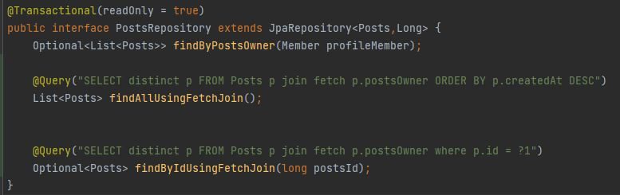

### 1. 연관관계를 잘못 매핑했다. 객체가 아니라 클래스단위로 생각하면 쉬움

#### OneToOne의 반대편은 OneToOne, OneToMany의 반대편은 ManyToOne

      그런데 지금 OneToMany의 반대편에 OneToOne을 설정해놨고 오류없이 잘돌아간다 왜?

-> 일단 OneToOne은 지연로딩이 안된다, 지연로딩을 생각한다면 ManyToOne 을 써야하겠지만 아니라면?  
 -> 웹에서 검색을해봐도 OneToMany의 반대편은 당연히 ManyToOne이라는 말만 있고  
 OneToOne을 사용했을시 어떤 오류가 발생하는지는 안적혀있다.  
-> 테이블도 내가 설계한대로 Link,Member,Posts,Playlist 4개만 존재함  
-> 엔티티는 누구나 알기쉽게 구조를 가져가는것이 맞다고 생각해서 일단 ManyToOne으로 변경하였다.

### 2. application.properties Encoding 확인하기

### 3. 로그인 수행을 하면 로그인은 되지만 /error로 redirect 되는 문제 발생

      스프링 부트 기본 설정에 따라 요청 처리시 에러가 발생하면
      org.springframework.boot.autoconfigure.web.servlet.error.ErrorMvcAutoConfiguration 가 처리한다고 한다.

      프로퍼티에서 spring.autoconfigure.exclude= 로 해당 핸들러를 제외시키면 동작한다고 하지만 올바른 해결방법은 아닌것 같다.

      로그인할 때 정적리소스를 찾지못하면 에러로 핸들링을 하는 것 같다.
      .antMatchers("/favicon.ico", "/resources/\*\*", "/error") 를 Web ignoring 시켜서 해결

      https://docs.spring.io/spring-boot/docs/1.4.3.RELEASE/reference/html/boot-features-developing-web-applications.html#boot-features-error-handling-custom-error-pages
      아니면 여기 나와있는 대로 error 폴더를 만들고 favicon을 추가시켜줘도 된다.

### 4. insert가 link와 playlist가 각 갯수만큼 날라가는 문제

 

@Query(FetchMode = subselect)로 oneToMany에 걸어주고  
PostsRepository에서 Post를 찾을때 fetch join을 걸어주었더니  
모든 Posts를 읽어올때 쿼리가 단 3개만 날라감

### 6. JPQL에 ORDER BY 절로 Posts가 생성된 순으로 정렬함

### Source

- https://2dongdong.tistory.com/29
