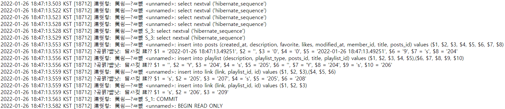

### 1. 검색 쿼리를 날릴때 Playlist,Link가 갯수만큼 날라간다

### 2. 벌크 insert 하기 위해서 application.properties에 별 옵션을 더 넣어도 안됨

### 3. Spring 로그 설정 문제로 안되는거처럼 보이는지 실제 postgresql을 로그를 보고 확인해야한다.

      -> 실제 DB 로그 확인 결과 벌크 insert 되는 것을 확인할 수 있음
      -> 근데 Link와 Playlist는 BatchSize 만큼 합쳐져서 나가지 않고
      어느정도 분리되어서 나간다 왜?
            -> https://vladmihalcea.com/postgresql-multi-row-insert-rewritebatchedinserts-property/
      왜냐하면 결국 DB에서 허용이 되야 하기 때문이다. 위 예에서도 보면 Batchsize
      가 10개지만 실제 DB로는 2번의 쿼리로 10개의 insert가 나뉘었다.

### 4. BatchSize를 300으로 잡으니깐 많은 insert 쿼리가 하나의 MultiRow insert 쿼리로 합쳐져서 나가는 것을 확인

