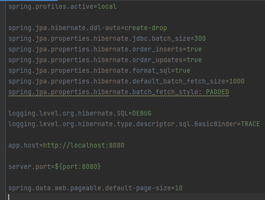
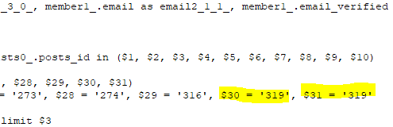

### 1. 검색 쿼리의 N+1 문제를 해결하기 위한 방법

Posts에서 fetch join을 하는 것이 아니라, Link에서부터 ManyToOne 관계로 변경하면  
Row수가 Link의 수로 결정됨 그래서 연관관계 변경이 아닌 BatchSize 설정을 사용하기로 함

    기존에 OneToMany를 전부 FetchMode.SUBSELECT로 IN 절 안에 서브쿼리를 통하여
    가져왔었는데 이 방법 대신에 BatchFetchSize를 설정하면 그 수만큼
    Hibernate가 PreparedStatement로 최적화하여 IN 절에
    ID 값을 넣어 보내는 것으로 바꾼다.

    이 방법을 사용하면 전부 Join해서 가져올 때보다 쿼리는 많이 나가지만
    거의 테이블 당 하나씩만 나가게 되며 데이터의 Row가 필요한만큼만 최적화 된다.

    사용 방법은 ToMany에 해당하는 엔티티 속성 위에 @BatchSize를 사용하거나
    전역 설정으로
    spring.jpa.properties.hibernate.default_batch_fetch_size=1000
    spring.jpa.properties.hibernate.batch_fetch_style: PADDED 을 주면 된다.

    fetch_style을 PADDED로 주게 되면 내가 설정한 최대 크기 만큼 나가게 된다.
    DYNAMIC을 주면 무조건 내가 원하는 크기만큼 나가긴 하지만 이것은 DB에서
    미리 캐싱해야하는 PreparedStatement가 많아지므로 PADDED를 사용하는 것이
    내 생각엔 가장 좋을 것 같다.(링크 참조 : https://www.inflearn.com/questions/34469)
    만약 25가 최대 크기인데 24개를 조회한다면 나머지 1개는 식별자 하나가 반복되어
    쿼리가 나가게 된다.(사진을 참고하면 쉽다.)

<b>[BatchSize 설정 사진]

[PADDED 옵션이 적용된 모습]</b>

### 2. 방법은 알았는데 이상하게 적용이 안됐다. 전체 조회 쿼리는 Batch fetch가 잘 작동하는데 이상하게 검색 쿼리만 날리면 N+1 문제가 그대로 발생하였다.

      알고보니 PostsService에서 searchPosts 메소드에 @Transactional(readOnly=true)가 붙어있지가 않아 발생한 문제였다.

### 3. 왜 countQuery가 없으면 오류가 뜨나?

      페이징을 하기 위해서는 전체 카운트가 꼭 있어야한다.
      그래야 몇 page까지 있는지 알 수 있다.

      그래서 countQuery가 없으면 Spring Data JPA가 임의로 원본 쿼리를 보고 countQuery를 작성하는데,
      이때 쿼리에 페치 조인이 들어가게 된다.

      페치 조인은 객체 그래프를 조회하는 기능이기 때문에 연관된 부모가 반드시 있어야하나,
      countQuery의 경우 count(u)로 조회 결과가 변경되었기 때문에 오류가 발생한 것이다.

      따라서 fetch join이나 복잡한 쿼리의 경우 반드시 countQuery를 분리해서 사용하자.

### Source

- https://dev-gorany.tistory.com/348
